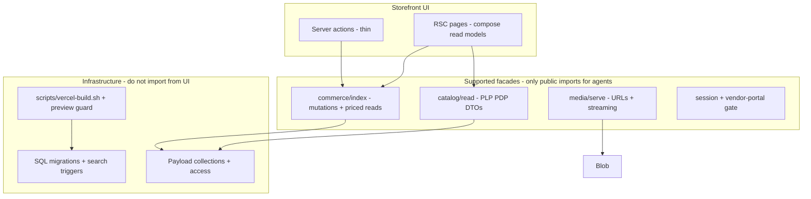

# Agent-friendly re-architecture plan (Phase 1)

**Repository:** [gpai-coder/B2B](https://github.com/gpai-coder/B2B)  
**Stack:** Next.js 15 (App Router) + Payload 3 + Neon Postgres + Vercel Blob, deployed on Vercel (`gpai1/b2b`)  
**Scope:** Planning only — no production refactor in this phase.  
**Data window:** `main` through `f73e4d7` (2026-10-04), 32 merged PRs, ~120 agent-authored commits vs ~32 human.

---

## Executive summary

Agents built most of the foundations quickly (`cursor/*` branches, PRs #1–#32). Recurring failures cluster around **environment/migration safety**, **test harness honesty**, **media/blob indirection**, **commerce concurrency**, and **duplicated data-access paths** (Payload `find` in UI routes alongside `getCommerce()`). The target architecture keeps Payload as the schema/ACL source of truth but forces **one supported path per concern**: commerce mutations via `src/commerce/`, catalog reads via `lib/catalog` + search provider, media via `lib/serve-blob-file` + `/api/vendor/media`, and deploy/migrate via guarded `scripts/vercel-build.sh` only.

---

## Methodology: `/correct` (failure mining)

### Sources

| Source | Finding |
| --- | --- |
| Git (`main`) | 42 commits; **18** titled `fix*`; **1** explicit revert chain (`d5e07c9` reverts race-handling from `8f2db85` / `28e6d53`) |
| Branches | **31** `cursor/*` remote branches; naming suffix `33d1` / `83b2` |
| GitHub PRs | **32** merged, **1** closed without merge ([#10](https://github.com/gpai-coder/B2B/pull/10) private blob — superseded by #11) |
| PR reviews | No human review bodies or Bugbot inline comments on PRs #1–#32 (Vercel deploy comments only) |
| Agent instructions | **No** `AGENTS.md`, **no** `.cursor/rules` in repo |
| Workaround comments | No production `TODO`/`HACK`/`workaround` in `src/` (only test fixtures using `HACK` strings) |
| Hot files (commit touch count) | `payload.config.ts`, `package.json`, `payload-types.ts`, `smoke.spec.ts`, `migrations/index.ts`, `commerce/postgres.ts` |
| `/recall` | `cursor-cloud-list-cloud-agents` shows many prior B2B runs (preview DB migrate `bc-8f91c3c9`, CI failure investigations for PRs #23/#26). No transcript mining in this phase. |

### Mistake-class table (≥2 occurrences)

| Class | Freq. (commits/PRs) | Examples | Severity | Preferred enforcement |
| --- | ---: | --- | --- | --- |
| **CI / E2E harness gaps** (“green” CI that did not reflect prod) | 13 fix commits; PRs [#13](https://github.com/gpai-coder/B2B/pull/13), [#6](https://github.com/gpai-coder/B2B/pull/6), [#24](https://github.com/gpai-coder/B2B/pull/24), [#23](https://github.com/gpai-coder/B2B/pull/23) | `aac9452` pipefail + prod `next build` for E2E; `e276c2a` smoke syntax error; `e05a058` teardown | quality | **Architecture:** CI job graph (migrate → seed → build → E2E) is the contract; **behavior tests** lock smoke paths |
| **Preview vs production DB / migrate safety** | 6 fix commits; PRs [#18](https://github.com/gpai-coder/B2B/pull/18), [#30](https://github.com/gpai-coder/B2B/pull/30)–[#32](https://github.com/gpai-coder/B2B/pull/32) | Preview migrate against prod URL; escape hatches removed in #31–#32 | **bug** | **Architecture:** `vercel-build.sh` + `check-preview-db.mjs` fingerprint gate; **CI** runs `migrate-prod-cart-reconcile.sh` + `db:migrate:check` |
| **Blob / vendor media read path** | 7 fix commits; PRs [#8](https://github.com/gpai-coder/B2B/pull/8)–[#12](https://github.com/gpai-coder/B2B/pull/12), [#14](https://github.com/gpai-coder/B2B/pull/14); closed #10 | PDP 500, CDN `cache=0`, tokenized reads, two-store migration | **bug** | **Architecture:** single `lib/blob-server-read` + `app/api/vendor/media` entry; **types** for media DTOs; **lint** ban duplicate blob URL builders |
| **Cart / quote / order concurrency & workflow** | 4+ fix commits; PRs [#21](https://github.com/gpai-coder/B2B/pull/21), [#23](https://github.com/gpai-coder/B2B/pull/23); `d5e07c9` revert | Row locks for cart; quote convert/withdraw race reverted after bad “success as no-op” | **bug** | **Architecture:** all mutations through `commerce/cart-serialized` + `lib/orders/*` transactions; **behavior tests** (`cart-concurrency`, `staff-quote-builder` int) |
| **Dual data-access in storefront** (`getPayload` + `getCommerce` in same flows) | 14+ `getPayload` call sites under `app/(frontend)/` | `products/[slug]/page.tsx` loads catalog via Payload then prices via commerce | quality / perf | **Architecture:** `lib/catalog/read-models` for catalog; commerce only for price/cart; **lint** `no-restricted-imports` on `getPayload` in `(frontend)` except allowlist |
| **Catalog / search / pricing drift** | 3+ fix commits; PRs [#16](https://github.com/gpai-coder/B2B/pull/16), [#19](https://github.com/gpai-coder/B2B/pull/19) | Search facet pricing ≠ PLP; PDP sanitize/contract label | bug / quality | **Architecture:** shared `resolve-unit-price` + search SQL uses same pricing inputs; **types** for priced row shape |
| **Security / CSP / REST access holes** | 3+ fix commits; PRs [#28](https://github.com/gpai-coder/B2B/pull/28), [#29](https://github.com/gpai-coder/B2B/pull/29); `f510302` | Vendor REST read on orders; CSP for admin avatars | **bug** | **Architecture:** access in `src/access` only; **behavior tests** `access-control`, `vendor-order-rest-access` |
| **Stacked-PR / branch bleed** | 2+ commits | `6c02da5` drop quote actions from auth branch; `2cc665c` package.json/CI after rebase | quality | **Docs/rules last:** PR checklist + smaller PR units (see work units) |
| **Migration-owned schema vs Payload push** | 2+ incidents; `src/lib/search/README.md` | `search_vector` / triggers; `a0c18b3` objectkey migration | **bug** | **Architecture:** SQL migrations own extension columns; **CI** always `PAYLOAD_DISABLE_PUSH=true`; **lint** on `payload migrate` in wrong scripts |
| **E2E timing / flake** | 3+ fix commits | `#19` login wait; `#24` product URL wait; smoke teardown | quality | **Behavior tests** with deterministic waits; avoid `networkidle` patterns |

Enforcement priority used above: **architecture** (module boundaries, single pipeline) → **types** (DTOs at boundaries) → **lint/CI** (named rules, script guards) → **behavior tests** → **docs/rules** (README, AGENTS.md).

---

## Methodology: `/architect` (current vs target)

### Current module map

```mermaid
flowchart TB
  subgraph ui [app/(frontend)]
    Pages[Server pages + server actions]
  end
  subgraph payload_layer [Payload]
    Collections[collections/*]
    Access[src/access]
    Migrations[src/migrations]
  end
  subgraph commerce_layer [src/commerce]
    Index[getCommerce]
    PG[postgres.ts impl]
    Cart[cart-serialized / checkout]
  end
  subgraph domain_lib [src/lib/*]
    Orders[lib/orders]
    Quotes[lib/quotes]
    Search[lib/search]
    Blob[lib/blob-*]
    Catalog[lib/catalog]
  end
  Pages -->|getPayload.find| payload_layer
  Pages -->|getCommerce| commerce_layer
  commerce_layer --> domain_lib
  commerce_layer --> payload_layer
  Search -->|db.execute| payload_layer
```

**Observations**

- **Commerce boundary exists** (`README` + `getCommerce`) but is **leaky**: storefront pages still embed Payload queries for catalog, account, and checkout context.
- **Domain logic split** between `commerce/*` and `lib/orders|quotes|checkout|cart` — correct for transactions, hard for agents to know where to edit.
- **Search** is intentionally outside Payload fields (`lib/search/README.md`) — easy for agents to add collection fields and break push/migrate.
- **Media** has multiple routes: `app/api/vendor/media`, `(payload)/api/media/file`, blob helpers — fixes landed across many PRs.
- **Deploy** is non-standard (`vercel-build` script); agents often edited `package.json` / migrate behavior (#18, #30–#32).

### Target architecture (agent-friendly)



### Key structural changes (eliminate top mistake classes)

1. **Facade layer with enforced imports**  
   - Add `src/facades/` or tighten existing `lib/catalog` + `commerce` as the only UI imports.  
   - ESLint `no-restricted-imports`: ban `getPayload` from `app/(frontend)/**` except `lib/**` and tests.

2. **Commerce owns all write paths**  
   - Cart, checkout, quote conversion, quick-order: UI calls `getCommerce()` only; no `payload.update` in actions.  
   - Staff/admin hooks stay in `lib/*` but are only invoked from commerce or Payload hooks (documented).

3. **Media single pipeline**  
   - All vendor-visible bytes flow: `resolveMediaId` → `serveBlobFile` / `api/vendor/media`.  
   - Deprecate parallel URL construction in components.

4. **Deploy & migrate as code-owned contract**  
   - Keep `scripts/vercel-build.sh` as sole migrate entry; extend **structural tests** (already in `vercel-build-guard.test.ts`) for any new env branch.  
   - Document Neon preview branch requirement in repo (not just Vercel dashboard).

5. **Agent instructions in repo**  
   - Add `AGENTS.md` + `.cursor/rules` mirroring enforcement table (where docs are last resort, they still reduce wrong-path edits).

6. **PR sizing**  
   - Align with README “Do not merge via agent; review each PR independently” — one facade/domain per PR.

---

## Prototype results

| Experiment | Result |
| --- | --- |
| Run `scripts/check-preview-db.test.ts` + `scripts/vercel-build-guard.test.ts` | **15/15 passed** — proves CI-style guards would fail if preview check or empty `VERCEL_ENV` regressed (simulates post-#31/#32 contract). |
| ESLint boundary spike (`getPayload` in frontend) | `eslint.config.mjs` has **no** `no-restricted-imports`; only Next defaults + TS warnings. A proposed rule would flag **14** frontend files today (e.g. `products/[slug]/page.tsx`). |
| `pnpm lint` | Not re-run full suite (time); config confirms agents can add Payload calls without CI failure. |
| Workaround comment scan | No actionable agent debt markers in `src/` — failures show up as fix commits instead. |

---

## Sequenced work units (independently shippable PRs)

| # | Unit | Delivers | Risk | Size |
| ---: | --- | --- | --- | --- |
| 1 | **AGENTS.md + `.cursor/rules`** | Mistake-class table, allowed import graph, “one way” per task, PR checklist (no stacked features) | Low | S |
| 2 | **ESLint import boundaries** | `no-restricted-imports` for `getPayload` in `(frontend)`; allowlist for transitional files | Med — may require small refactors | M |
| 3 | **Catalog read facade** | Move PDP/PLP/search page data loading to `lib/catalog/read-models/*`; pages become thin | Med | L |
| 4 | **Commerce action audit** | Ensure all `app/(frontend)/**/actions.ts` use only `getCommerce` + session; remove stray Payload writes | Med | M |
| 5 | **Media pipeline consolidation** | Single export surface; delete/redirect duplicate routes; extend `catalog-media-access` tests | Med | M |
| 6 | **Migration safety docs + CI assert** | Expand `lib/search/README` pattern to all SQL-owned columns; fail CI if `PAYLOAD_DISABLE_PUSH` unset in test jobs | Low | S |
| 7 | **Concurrency regression pack** | Document quote/cart locking policy; ensure `d5e07c9`-style reverts require int test updates | Low | S |
| 8 | **Preview DB runbook** | Neon branch per preview + env var matrix in README (complements fingerprint guard) | Low | S |

**Phase 2+ (out of scope here):** MuleSoft/SAP swap inside `commerce/postgres.ts`, Typesense provider, microfrontend split.

---

## Remaining questions for Ganesh

1. **Preview Neon strategy:** Is every Vercel preview wired to an isolated Neon branch today, or should the plan assume fingerprint-only guard until infra is updated?  
2. **Catalog read facade:** OK to accept slightly less flexible Payload `depth` in pages in exchange for stable DTOs?  
3. **Admin/staff UI:** Should staff workflows stay Payload-admin-only, or will agents add custom staff routes (affects facade scope)?

---

## Appendix: current vs target quick reference

| Task | Supported way today | Target |
| --- | --- | --- |
| Vendor cart/checkout | `getCommerce()` | unchanged — enforce via lint |
| Catalog browse / PDP | Mixed `getPayload` + commerce | `lib/catalog/read-models` |
| Pricing | `commerce` + `lib/pricing` | commerce facade exposes prices only |
| Search | `lib/search` provider | unchanged; document migration-owned columns |
| Media | blob libs + API routes | `media` facade |
| Schema change | `pnpm db:migrate` + SQL files | unchanged + CI push disabled |
| Deploy migrate | `scripts/vercel-build.sh` | unchanged + structural tests |

---

*Generated in Phase 1 planning; implementation PRs not included.*
